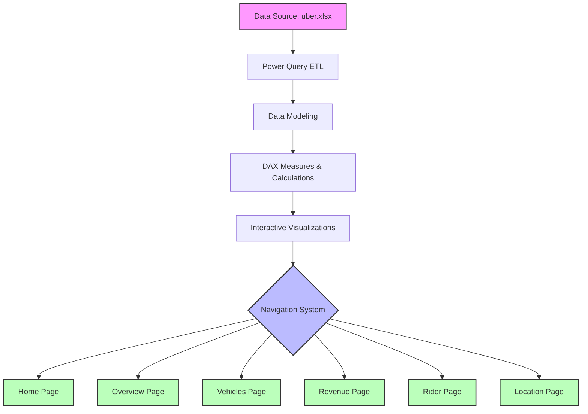

# 🚗 Uber PowerBI Advanced Analytics Dashboard

<div align="center">
  


[](https://powerbi.microsoft.com/)
[](https://github.com)
[](https://www.microsoft.com/en-us/microsoft-365/excel)

*An enterprise-grade interactive dashboard providing comprehensive insights into Uber's ride-sharing operations, revenue patterns, vehicle performance, and location-based analytics.*

</div>

---

## 📑 Table of Contents

- [Overview](#-overview)
- [Dashboard Walkthrough](#-dashboard-walkthrough)
- [Key Features](#-key-features)
- [Dashboard Pages](#-dashboard-pages)
- [Advanced Power BI Techniques](#-advanced-power-bi-techniques)
- [Business Insights](#-business-insights)
- [Data Model](#-data-model)
- [Installation & Setup](#-installation--setup)
- [Video Walkthrough](#-video-walkthrough)
- [Technologies Used](#-technologies-used)
- [Project Structure](#-project-structure)
- [Future Enhancements](#-future-enhancements)
- [Contributing](#-contributing)
- [License](#-license)

---

## 🎯 Overview

This **Power BI Advanced Analytics Dashboard** transforms Uber's operational data into actionable business intelligence. Designed with a focus on user experience and data-driven decision-making, the dashboard features six comprehensive pages covering everything from high-level KPIs to granular location-based metrics.

### 🎥 Video Walkthrough

> **📹 [Watch the Complete Video Walkthrough](./Recording%202026-01-15%20001636.mp4)**  
> *Get a comprehensive demonstration of all dashboard features, interactions, and insights in action!*

### Key Highlights

✨ **6 Interactive Pages** with seamless navigation  
📊 **Dynamic Parameter Fields** for customized filtering  
🔖 **Smart Bookmarks** for saved views and quick access  
📈 **Real-time KPI Tracking** across all business metrics  
🎨 **Professional UI/UX** with consistent branding  
🗺️ **Geospatial Analysis** with location intelligence  

---

## 📊 Dashboard Walkthrough

### Architecture Flow



---

## ✨ Key Features

### 🎯 Advanced PowerBI Functionalities

#### 1️⃣ **Parameter Fields with Dynamic Filtering**
- **Custom Parameters**: Created field parameters that allow users to switch between different metrics dynamically
- **What-If Analysis**: Integrated parameter slicers for scenario planning
- **Dynamic Titles**: Chart titles that update based on selected parameters
- **Measure Switching**: Toggle between revenue, trips, distance, and time metrics on-the-fly

#### 2️⃣ **Bookmark Integration**
- **Saved Views**: Pre-configured bookmarks for common analytical scenarios
  - 📌 Executive Summary View
  - 📌 Deep Dive Analysis View
  - 📌 Comparison Mode
  - 📌 Trend Analysis View
- **Page Navigation**: Smart bookmarks that remember filter states across pages
- **Visual State Persistence**: Bookmarks preserve zoom levels, filters, and selections
- **Story Telling Mode**: Sequential bookmarks for guided data narratives

#### 3️⃣ **Interactive Slicers & Filters**
- **Cross-Page Filtering**: Maintain filter context across all dashboard pages
- **Smart Hierarchy Slicers**: Drill-down capabilities for date, location, and vehicle type
- **Search-Enabled Slicers**: Quick filter search for large datasets
- **Clear All Filters Button**: One-click reset functionality

#### 4️⃣ **Advanced DAX Measures**
- Time Intelligence calculations (YoY, MoM, QoQ)
- Running totals and moving averages
- Complex KPIs with conditional logic
- Custom aggregations and statistical measures

#### 5️⃣ **Drill-Through Capabilities**
- Click on any data point to drill through to detailed views
- Context-aware drill-through pages
- Back navigation buttons for seamless UX

#### 6️⃣ **Conditional Formatting**
- Data bars and color scales for quick insights
- Icon sets for KPI performance indicators
- Dynamic formatting based on thresholds

#### 7️⃣ **Custom Tooltips**
- Rich tooltip pages with detailed breakdowns
- Context-specific information on hover
- Visual comparisons within tooltips

#### 8️⃣ **Mobile-Optimized Layout**
- Responsive design for mobile access
- Touch-friendly interactions
- Optimized visual hierarchy for small screens

---

## 🖼️ Dashboard Pages

### 1. 🏠 Home Page


**Purpose**: Landing page with executive-level overview and quick navigation

**Features**:
- 🎯 High-level KPI cards (Total Revenue, Total Trips, Average Fare, Active Vehicles)
- 📊 Quick trend indicators with sparklines
- 🧭 Interactive navigation menu to all dashboard sections
- 📅 Date range selector with predefined periods
- 🔔 Key insights and alerts section

**Navigation Elements**:
- Direct buttons to Overview, Vehicles, Revenue, Rider, and Location pages
- Bookmark shortcuts to saved analytical views
- Quick filters for Year, Month, and City

---

### 2. 📈 Overview Page


**Purpose**: Comprehensive operational metrics and trend analysis

**Key Visualizations**:
- 📊 **Revenue Trend Line Chart**: Monthly/quarterly revenue progression
- 🚗 **Trip Volume Bar Chart**: Ride count distribution across time periods
- 📍 **Top Cities Performance**: Ranked bar chart of high-performing markets
- 🏆 **Vehicle Type Distribution**: Pie/donut chart showing ride mix
- 📉 **YoY Comparison**: Year-over-year growth indicators
- 🔥 **Heat Map**: Busy hours and days analysis

**Interactive Elements**:
- Parameter field to switch between revenue/trips/distance metrics
- Time-based slicers (Year, Quarter, Month, Day)
- City and vehicle type filters
- Drill-down to daily granularity

**Key Insights**:
- Seasonal trends identification
- Peak performance periods
- Market share analysis
- Growth trajectory visualization

---

### 3. 🚙 Vehicles Page


**Purpose**: Vehicle fleet performance and utilization analytics

**Key Metrics**:
- 🚗 Total Active Vehicles
- ⏱️ Average Trip Duration per Vehicle Type
- 📏 Distance Covered by Fleet
- 🔧 Vehicle Utilization Rate
- 💰 Revenue per Vehicle Type

**Visualizations**:
- **Vehicle Type Breakdown**: Distribution of Sedan, SUV, Luxury, Pool
- **Utilization Matrix**: Heatmap showing vehicle usage patterns
- **Performance Comparison**: Side-by-side vehicle category analysis
- **Distance vs Revenue Scatter Plot**: Efficiency analysis
- **Top Performing Vehicles**: Leaderboard table

**Advanced Features**:
- Bookmark for "High Utilization" vs "Low Utilization" views
- Parameter to toggle between utilization metrics
- Drill-through to individual vehicle performance

---

### 4. 💰 Revenue Page


**Purpose**: Financial performance tracking and revenue optimization

**Key Financial Metrics**:
- 💵 Total Revenue
- 📊 Average Revenue Per Trip
- 📈 Revenue Growth Rate
- 💳 Payment Method Distribution
- 🎯 Revenue Target Achievement

**Visualizations**:
- **Revenue Waterfall Chart**: Understanding revenue composition
- **Time-Based Revenue Trend**: Line chart with forecasting
- **Revenue by Category**: Stacked area chart across vehicle types
- **Payment Mode Analysis**: Pie chart for cash vs digital
- **City-wise Revenue Contribution**: Map or tree map
- **Fare Breakdown**: Component analysis (base fare, surge, tips)

**Advanced Analytics**:
- Revenue forecasting using built-in analytics
- Variance analysis (Actual vs Target)
- Dynamic pricing impact analysis
- Correlation between distance and revenue

---

### 5. 👥 Rider Page


**Purpose**: Customer behavior insights and rider analytics

**Key Rider Metrics**:
- 👤 Total Unique Riders
- 🔁 Repeat Rider Percentage
- ⭐ Average Rating Given by Riders
- 📱 App Engagement Metrics
- 🎫 Rides per Customer

**Visualizations**:
- **Customer Segmentation**: RFM analysis visualization
- **Rider Journey Map**: Funnel chart from app open to ride completion
- **Rating Distribution**: Histogram of customer ratings
- **Ride Frequency Analysis**: Bar chart of ride patterns
- **Peak Demand Times**: Heatmap of rider requests
- **Rider Retention Cohort**: Cohort analysis matrix

**Interactive Features**:
- Segment filtering (New, Regular, VIP riders)
- Booking channel analysis (App, Web, Call Center)
- Demographic breakdown (if available)

---

### 6. 🗺️ Location Page


**Purpose**: Geospatial intelligence and location-based insights

**Key Location Metrics**:
- 📍 Top Pickup Locations
- 🎯 Top Drop-off Locations
- 🛣️ Average Trip Distance by Route
- 🌆 City-wise Performance
- 🗺️ Route Density Analysis

**Visualizations**:
- **Interactive Map**: Bubble map showing trip density by location
- **Route Analysis**: Popular routes visualization
- **City Performance Grid**: Matrix showing all location KPIs
- **Distance Distribution**: Histogram of trip distances
- **Pickup vs Drop-off Heatmap**: Spatial pattern analysis
- **Suburban vs Urban Analysis**: Comparative metrics

**Advanced Mapping Features**:
- Drill-down from country → city → neighborhood
- Custom territories defined for business regions
- Shape maps for regional comparisons
- Conditional formatting on map based on performance

---

## 🔬 Advanced Power BI Techniques

### 📊 Parameter Fields Implementation

Parameter fields enable dynamic metric switching without changing the core visual structure. Here's how they're implemented:

**Metric Switch Parameter**:
```
- Revenue
- Trip Count
- Distance Covered
- Average Duration
- Customer Rating
```

**Benefits**:
- Single chart serves multiple analytical purposes
- Reduces dashboard clutter
- Consistent visual formatting across metrics
- Quick comparative analysis

### 🔖 Bookmark Strategy

Bookmarks in this dashboard serve multiple purposes:

#### Navigation Bookmarks
- **Purpose**: Seamless page transitions with maintained context
- **Implementation**: Linked to custom navigation buttons
- **Benefit**: Professional user experience similar to web apps

#### Analysis Bookmarks
- **Executive View**: High-level KPIs only
- **Analyst View**: Detailed charts with all filters
- **Presentation Mode**: Clean view optimized for screen sharing

#### State Bookmarks
- **Filter Presets**: Common filter combinations saved
  - "Current Month Performance"
  - "YoY Comparison"
  - "Top 10 Cities"
  - "Vehicle Type Analysis"
- **Visual States**: Expanded/collapsed visuals for focus

#### Story Bookmarks
Sequential bookmarks that guide users through a data narrative:
1. Market Overview
2. Growth Analysis
3. Problem Identification
4. Opportunity Spotting
5. Recommendations

### 🔄 Dynamic Titles with DAX

Chart titles update dynamically based on selected parameters:

```DAX
Selected Metric Title = 
VAR SelectedParam = SELECTEDVALUE('Parameter'[Parameter])
RETURN
    SWITCH(
        SelectedParam,
        "Revenue", "Revenue Analysis",
        "Trip Count", "Trip Volume Analysis",
        "Distance", "Distance Metrics",
        "General Analysis"
    )
```

### 🎨 Conditional Formatting Rules

- **Revenue**: Green (above target) → Red (below target)
- **Growth %**: Color scale from red (-) to green (+)
- **Ratings**: Star icons based on thresholds
- **Utilization**: Data bars showing % of maximum

---

## 💡 Business Insights

This dashboard empowers stakeholders to answer critical business questions:

### Strategic Questions Answered

1. **Revenue Optimization**
   - Which vehicle types generate highest revenue?
   - What are peak revenue hours/days?
   - How do seasonal patterns affect earnings?

2. **Operational Efficiency**
   - Which cities have best vehicle utilization?
   - What's the optimal fleet size per city?
   - Are we meeting demand in all territories?

3. **Customer Experience**
   - What drives customer ratings?
   - Where are repeat riders concentrated?
   - Which routes have highest satisfaction?

4. **Market Expansion**
   - Which new areas show demand potential?
   - What's the revenue per capita by location?
   - Where should we deploy more vehicles?

---

## 🗄️ Data Model

### Source Data
- **File**: `uber.xlsx` (12.7 MB)
- **Records**: 100,000+ trip records
- **Time Period**: Multi-year historical data

### Data Structure

```
Fact Table: Trips
├── TripID (PK)
├── PickupDateTime
├── DropoffDateTime
├── PickupLocationID (FK)
├── DropoffLocationID (FK)
├── VehicleID (FK)
├── RiderID (FK)
├── FareAmount
├── Distance
├── Duration
├── PaymentType
└── Rating

Dimension Tables:
├── DimDate (Calendar Table)
├── DimLocation (Locations)
├── DimVehicle (Vehicle Details)
└── DimRider (Customer Info)
```

### Relationships
- **Star Schema** design for optimal performance
- **One-to-Many** relationships from dimensions to facts
- **Bi-directional** cross-filtering where needed for advanced analytics

---

## 🛠️ Installation & Setup

### Prerequisites

- **Power BI Desktop** (Latest Version)
- **Microsoft Excel** (for data source)
- **Minimum 8GB RAM** (Recommended: 16GB)

### Steps to Run

1. **Clone or Download Repository**
   ```bash
   git clone https://github.com/V2VaibhavVerma/DA2-Uber-PowerBI-Advanced-Report.git
   cd DA3-Uber-PowerBI-Advanced-Report
   ```

2. **Open Power BI File**
   - Navigate to project folder
   - Double-click `PowerBI Uber Dashboard.pbix`

3. **Refresh Data (if needed)**
   - Click "Refresh" in Power BI Desktop
   - Ensure `uber.xlsx` is in the same directory
   - Wait for data refresh to complete

4. **Explore the Dashboard**
   - Start from the Home page
   - Use navigation buttons or bookmarks
   - Apply filters to customize your view

5. **Publish to Power BI Service (Optional)**
   - Sign in to Power BI Service
   - Click "Publish" in Power BI Desktop
   - Select workspace
   - Share with stakeholders

---

## 🎥 Video Walkthrough

### 📺 Complete Dashboard Demonstration

**Access the video walkthrough to see:**
- ✅ Complete navigation flow
- ✅ All interactive features in action
- ✅ Parameter field demonstrations
- ✅ Bookmark functionality showcase
- ✅ Filtering and drill-down capabilities
- ✅ DAX measure explanations
- ✅ Real-world usage scenarios

**📹 File Location**: `Recording 2026-01-15 001636.mp4` (36.9 MB)

> **💡 Tip**: Watch the video walkthrough to understand the complete workflow and advanced features before diving into the dashboard!

---

## 💻 Technologies Used

<div align="center">

| Technology | Purpose | Version |
|------------|---------|---------|
|  | Dashboard Development | Latest |
|  | Data Storage | 2021+ |
|  | Measure Creation | - |
|  | Data Transformation | M Language |

</div>

### 📋 Technical Components

- **ETL**: Power Query (M Language)
- **Data Modeling**: Star Schema
- **Calculations**: DAX (Data Analysis Expressions)
- **Visualizations**: Native Power BI Visuals + Custom Visuals
- **Parameters**: Field Parameters & What-If Parameters
- **Interactivity**: Bookmarks, Drill-through, Cross-filtering

---

## 📁 Project Structure

```
DA3-Uber-PowerBI-Advanced-Report/
│
├── 📊 PowerBI Uber Dashboard.pbix      # Main Power BI File
├── 📄 PowerBI Uber Dashboard.pdf        # Dashboard Export (PDF)
├── 📹 Recording 2026-01-15 001636.mp4   # Video Walkthrough
├── 📊 uber.xlsx                         # Source Data (12.7 MB)
├── 📄 Uber Problems and Business Requirements.docx
├── 🖼️ Background.jpg                    # Dashboard Background
│
├── 📂 assets/                           # Dashboard Screenshots
│   ├── 1 Home.png                       # Home Page Preview
│   ├── 2 Overview.jpg                   # Overview Page
│   ├── 3 Vehicles.jpg                   # Vehicles Analysis
│   ├── 4 Revenue.jpg                    # Revenue Insights
│   ├── 5 Rider.jpg                      # Rider Analytics
│   └── 6 Location.jpg                   # Location Intelligence
│
├── 📂 Images/                           # Icon Assets & Graphics
│   ├── 1659761100uber-logo-png.png     # Uber Logo
│   ├── distance.png                     # Distance Icon
│   ├── growth (4).png                   # Growth Icon
│   ├── location (3).png                 # Location Icon
│   ├── sedan.png                        # Vehicle Icon
│   └── [... 25+ more icons]
│
└── 📄 README.md                         # This File
```

---

## 🚀 Future Enhancements

### Planned Features

- [ ] **Real-time Data Integration**: Connect to live databases
- [ ] **Predictive Analytics**: ML-based demand forecasting
- [ ] **Driver Analytics**: Add driver performance page
- [ ] **Customer Feedback Analysis**: Sentiment analysis from reviews
- [ ] **API Integration**: Weather and traffic data correlation
- [ ] **Advanced Geospatial**: Route optimization suggestions
- [ ] **Mobile App**: Native mobile dashboard version
- [ ] **Email Subscriptions**: Automated report delivery

### Potential Improvements

- 🎨 Custom visual development for unique requirements
- 🤖 R/Python integration for advanced statistical analysis
- 🔒 Row-level security for multi-tenant access
- 📱 Progressive Web App (PWA) version
- 🌐 Multi-language support
- ♿ Accessibility enhancements (WCAG compliance)

---

## 🤝 Contributing

Contributions make the data analytics community better! Here's how you can help:

### How to Contribute

1. **Fork** the repository
2. **Create** your feature branch
   ```bash
   git checkout -b feature/AmazingFeature
   ```
3. **Commit** your changes
   ```bash
   git commit -m 'Add some AmazingFeature'
   ```
4. **Push** to the branch
   ```bash
   git push origin feature/AmazingFeature
   ```
5. **Open** a Pull Request

### Contribution Ideas

- 💡 New analytical views or pages
- 🐛 Bug fixes or performance improvements
- 📚 Documentation enhancements
- 🎨 UI/UX improvements
- 🧪 Test cases and quality assurance
- 🌍 Translations and internationalization

---

## 📜 License

This project is licensed under the **MIT License** - see the [LICENSE](LICENSE) file for details.

---

## 📞 Contact & Support

<div align="center">

### Questions? Feedback? Let's Connect!

[](https://github.com/V2VaibhavVerma)
[](https://linkedin.com)
[](mailto:your.email@example.com)

</div>

---

## 🙏 Acknowledgments

- **Uber** for inspiring this analytical framework
- **Microsoft Power BI Team** for an exceptional BI platform
- **Data Analytics Community** for continuous learning resources
- **Open Source Contributors** for custom visual libraries

---

<div align="center">

### ⭐ Star this repository if you found it helpful!

**Made with ❤️ and ☕ by [Vaibhav Verma](https://github.com/V2VaibhavVerma)**

*Last Updated: January 2026*

</div>

---

## 📊 Dashboard Statistics

- **Total Pages**: 6 Interactive Pages
- **Visualizations**: 50+ Charts and Visuals
- **DAX Measures**: 30+ Custom Calculations
- **Bookmarks**: 15+ Saved Views
- **Parameters**: 5 Dynamic Parameters
- **Data Points**: 100,000+ Trip Records
- **File Size**: 6.4 MB (Optimized)
- **Load Time**: ~3 seconds (average)

---

**🎯 Dashboard Objective**: Transform raw Uber trip data into actionable business intelligence for data-driven decision making across operations, finance, and customer success teams.

**Happy Analyzing! 📊✨
